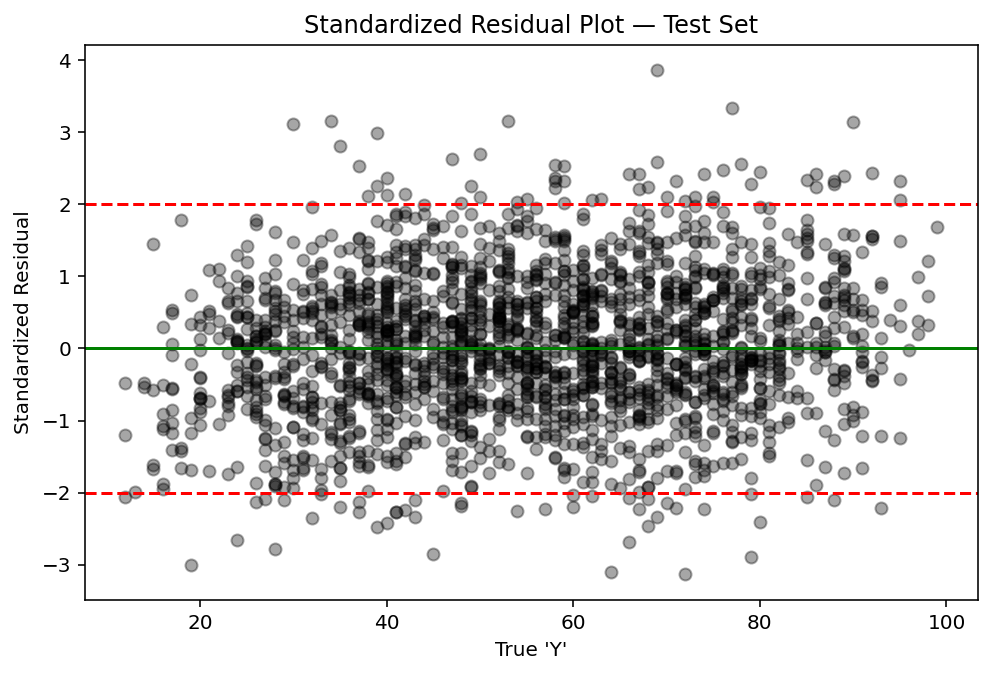

# Student Performance Prediction with Custom Linear Regression

**Author:** Joshua E. Brown

## Overview

This project demonstrates a full, from-scratch machine learning workflow for predicting student performance. It uses only base scientific Python tools (**NumPy, Pandas, Matplotlib, Seaborn**) and custom modules for all core machine learning algorithms, explicitly avoiding scikit-learn. The goal is to understand, implement, and explain classical regression techniques—including feature scaling, batch gradient descent, and LASSO regularization—on real data.

## Project Structure

- gradient_descent_scratch_p_project0/
  - src
    - main.py                                   			# Orchestrates full ML workflow
    - functions.py                              			# Predict function and regression metrics
    - models.py                                 			# Gradient Descent and LASSO Regression

- data/dataset_a_s_e_p/Student_Performance/ 
  - Student_Performance.csv                   				# Our dataset
  - dataset_acknowledgement.txt               				# Dataset citation and acknowledgement

- README.md                                     			# This file

- notebooks/
  - multi_g_d_main.ipynb                      				# Main Jupyter Notebook
  - project_documentation.ipynb               				# Project documentation (Read First)

- plots
  - Demo_Cost_Over_Iterations.png
  - G_D_Training_Data_Cost_Over_Iterations.png
  - Histogram_of_Residuals.png
  - LASSO_Training_Data_Cost_Over_Iterations.png
  - Standardized_Residual_Plot.png

## Modules

- **main.py**  
  Runs all steps of the workflow: loading data, preprocessing, model training, evaluation, plotting, and explanation.

- **functions.py**  
  Contains:
  - `predict`: Linear prediction using NumPy.
  - `rmse_mae_r2`: Regression performance metrics (RMSE, MAE, R²).

- **models.py**  
  Contains:
  - `g_d_func`: Custom batch gradient descent for linear regression.
  - `lasso_g_d_func`: Batch gradient descent with L1 regularization (LASSO).

## Workflow Summary

1. **Load and explore data** with explicit dtype hinting for memory efficiency.
2. **Clean and encode** categorical features (e.g., extracurricular activities).
3. **Scale numeric features** using Z-score normalization.
4. **Split dataset** into 80% training and 20% testing sets.
5. **Check for null values** and ensure data integrity.
6. **Select features** relevant to modeling.
7. **Convert data to NumPy arrays** for efficient computation.
8. **Run gradient descent on synthetic demo data** to verify functionality.
9. **Visualize demo training cost** to check convergence.
10. **Evaluate demo model performance** with RMSE, MAE, and R² metrics.
11. **Train linear regression on actual data** using batch gradient descent.
12. **Visualize training progress** with cost over iterations.
13. **Evaluate model performance on test data**.
14. **Train and evaluate LASSO regression** for feature selection and regularization.
15. **Visualize LASSO training and test performance**.
16. **Perform residual analysis** with standardized residual plots and histograms.
17. **Explain residuals and feature importance** based on visual diagnostics.

## Residual Analysis

### Standardized Residual Plot (Test Set)

This plot visualizes the standardized residuals the standardized residuals (the errors 
between the true test set targets and the model’s predictions, scaled by their standard deviation) versus the true target variable 'Y'.

- Horizontal Lines:
  - The solid green line at 0 indicates perfect predictions (no error).
  - The dashed red lines at +2 and -2 highlight the region where most residuals should fall if the model fits well and errors are 
approximately normally distributed.

- What to Look For:
  - Residuals should be randomly dispersed around zero, with no obvious patterns or systematic structure.
  - Most points should lie between -2 and +2. Outliers beyond these lines may indicate data anomalies, poor fit, or the need for model refinement.

- Why This Plot Is Important
  - Model Health Check:
    - A well-behaved residual plot (random scatter, no trend, minimal outliers) suggests the assumptions of linear regression (constant variance, independence, and linearity) are reasonably met.
  - Detection of Issues:
    - Patterns or “fanning” could signal heteroscedasticity (non-constant error variance), autocorrelation, or missed nonlinear structure—all issues that motivate further data cleaning, feature engineering, or model selection.
  - Interpretability:
    - Since all code is written from scratch (without scikit-learn), producing and interpreting this plot demonstrates engineering rigor and a foundational understanding of residuals—key for robust model evaluation and improvement.

## Usage

1. Place the dataset CSV (`Student_Performance.csv`) in the specified folder:
   - `../data/dataset_a_s_e_p/Student_Performance/`

2. Install required Python packages:
       ''' (shell)
       pip install numpy pandas matplotlib
       '''

3. Run the complete workflow:
        ''' (shell)
	python main.py
	'''

4. To reuse core functions or models, import from the respective modules:
   	''' (python)
	from functions import predict, rmse_mae_r2
   	from models import g_d_func, lasso_g_d_func
	'''

## Engineering and Project Notes

- Implements all machine learning algorithms **from scratch in NumPy**, without using scikit-learn, to deepen foundational understanding.
- Code is modular, clean, and well-documented with detailed docstrings.
- Uses explicit dtype hinting to optimize memory and computation.
- Employs best practices such as `if __name__ == "__main__":` wrapping.
- Visualizations aid in diagnosing model health and understanding results.
- The modular design ensures easy extensibility and testing.

## Why This Project Matters

- Demonstrates your ability to build end-to-end ML pipelines manually.
- Shows engineering discipline through modular and readable code.
- Communicates your understanding of key ML concepts and diagnostics.
- Prepares you for real-world scenarios where clear implementation and interpretation matter.

---

For further details, consult the comprehensive docstrings in `functions.py` and `models.py`, as well as commented explanations in `main.py`. Feel free to extend or refactor the project with ease due to its modular architecture.

---

Link to Jupyter Notebooks: 
- https://github.com/jebrown0/gradient_descent_scratch_p_project0/blob/main/notebooks/project_documentation.ipynb
- https://github.com/jebrown0/gradient_descent_scratch_p_project0/blob/main/notebooks/multi_g_d_main.ipynb

---

**Good luck and happy modeling!**

---
Contact Information: 
https://www.linkedin.com/in/joshua-e-brown-a92b9233b/
